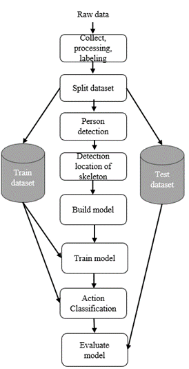

[English](README.md) | [简体中文](cn_readme.md) | [Tiếng việt](README.vietnam-vn.md)

## Contents
1. [OpenPose with Recurrent Neural Network](#introduction)
2. [Results](#results)
3. [Installation](#installation)
4. [Quick Start Overview](#quick-start-overview)
5. [Structures](#structures)
6. [Send Us Feedback!](#send-us-feedback)
7. [Thanks](#thanks)
8. [License](#license)


# Introduction

此项目提供了OpenPose + RNN的异常检测实现。为了简单起见，我们在此自述文件的其余部分中将此模型称为OpenPoseRNN。我们还要感谢Minh Chuan-Pham博士和Quoc Viet-Hoang博士对此项目的支持。这种基于深度学习的系统正在全球发达国家如英国、法国、美国以及日本、韩国、中国等亚洲国家中应用。一些大学如清华大学、北京大学、斯坦福大学等使用技术防止考试作弊。它正在与考试监考员合作实施，以达到最高的效果并确保考试的公平性。

# Results
### 作弊识别总结（使用OpenPose + Yolov3+ 循环神经网络）
<p align="center">
    
    <br>
    <sup>使用12422TN类进行测试 <a href="https://github.com/CMU-Perceptual-Computing-Lab/openpose" target="_blank"><i> on OpenPose </i></a>
</p>

### For Human Detection
对于这部分，我们使用 [YOLOv3](https://github.com/ultralytics/yolov3) 用于检测房间中的人。为了评估这个模型，我们使用从原始数据集分割出来的trainval35k集。 [MS-COCO 2017](https://cocodataset.org/#home)  数据集. 结果显示在表1中。

**表 1. 与其他3种模型的人体检测图像的比较结果**
|    Models   | Avg. | Precision |  IoU |
|:-----------:|:----:|:---------:|:----:|
| [Faster-RCNN](https://arxiv.org/abs/1506.01497) | 21.9 |    42.7   |   -  |
|    SSD300   | 25.2 |    43.1   | 26.1 |
|    YOLOv2   | 21.6 |     44    | 19.2 |
|   **Ours**    |**25.3**| **44.5**   | **25.9** |

### 用于骨架位置定位

用于骨架位置定位, 我们使用 [OpenPose]("https://github.com/CMU-Perceptual-Computing-Lab/openpose) 为了检测人体骨骼，我们使用了这个模型进行评估 [MS-COCO2015](https://cocodataset.org/#home) 数据集。结果显示在表2中。

**表 2. 与其他两种模型相比，骨架位置定位的评估结果**
|     Models    |  AP@0.5  |  AP@0.75 | AP medium | Ap large |
|:-------------:|:--------:|:--------:|:---------:|----------|
| [AlphaPose]() |   89.2   |   79.1   |     69    | 78.6     |
|     Detectron Mask-RCNN    |   25.2   |   43.1   |    26.1   | 68.2     |
|    **Ours**   | **88.0** | **73.1** |  **62.2** | **78.6** |

此外，我们还使用 FPS 和 GPU 内存来评估这一点。结果显示在表 3 中，用于多人和表 4 中的单人.

**表 3. 多人结果**
|     Models    |  GPU Memory Usage  |  FPS(Frame Per second  |
|:-------------:|:--------:|:--------:|
| AlphaPose |   73.4%   |   1.15   |
|    **Ours**   | **21.3%** | **18.39** |

**表 4. 单人结果**
|     Models    |  GPU Memory Usage  |  FPS(Frame Per second  |
|:-------------:|:--------:|:--------:|
| AlphaPose |   60.3%   |   23.71   |
|    **Ours**   | **21.3%** | **18.77** |

### For recognition 
我们用了 [Recurrrent Neural Network](https://en.wikipedia.org/wiki/Recurrent_neural_network) 我们使用循环神经网络(RNN)来对考场中的行为进行分类。为了评估这部分，我们使用了两个指标，即混淆矩阵和接收者操作特征曲线(ROC)。结果如下所示 [图 1](github/image/confMatrix.jpg) and [图 1](github/image/RocCurves)

<p align="center">
    
    <br>
    <sup>图 1. 所有标签的结果<a href="https://en.wikipedia.org/wiki/Confusion_matrix" target="_blank"><i> Confusion Matrix  </i></a>
</p>

<p align="center">
    
    <br>
    <sup>图 2. 所有标签的结果 <a href="https://developers.google.com/machine-learning/crash-course/classification/roc-and-auc" target="_blank"><i> ROC  </i></a>
</p>

        
# Installation

### 使用Python Base
要求 python >= 3.7
1. 安装依赖库
 ```bash
 pip install -r requirements.txt
```
2. 安装依赖文件
- 切换目录到 ``` OpenPose/graph_models/VGG_origin```, 你可以用这个命令切换目录 ```cd OpenPose/graph_models/VGG_origin ```
- 然后你必须运行 ``` file_requirements.py ``` 或者
 ``` bash
python file_requirements.py
```
3. 用其他步骤安装依赖文件 ( 可选 )
- 如果你的第二步没有成功，你可以从 [Google Drive](https://drive.google.com/drive/folders/1Y4coXLsVzCXYuCKpyDfQBqpHH8Aj-Yg5?usp=sharing)下载权重.
- 把下载的 ```graph_models``` 文件夹移动到 ```OpenPose\graph_models``` 

### 使用 Anaconda
1. 安装依赖库
   - 安装依赖库 ``` openpose.yaml``` 文件加载依赖库。.
   - 你可以在 ```Environment``` 文件夹里找到 ```openpose.yaml``` 文件

2. 安装依赖文件
- 切换目录到 ``` OpenPose/graph_models/VGG_origin```, 你可以用这个命令切换目录 ```cd OpenPose/graph_models/VGG_origin ```
- 然后你必须运行 ``` file_requirements.py ``` 或者
 ``` bash
python file_requirements.py
```
3. 用其他步骤安装依赖文件 ( 可选 )
- 如果你的第二步没有成功，你可以从 [Google Drive](https://drive.google.com/drive/folders/1Y4coXLsVzCXYuCKpyDfQBqpHH8Aj-Yg5?usp=sharing)下载权重.
- 把下载的 ```graph_models``` 文件夹移动到 ```OpenPose\graph_models``` 


# Quick Start Overview
### 使用Python基础环境和Anaconda环境
1. 快速运行
- 您可以运行此文件main.py来启动此项目。
2. [可选] 要训练模型，您可以使用 ```create_data.py``` 导出数据点并移动到文件夹 ```Action\trainning```，并使用 .ipnb文件 ```train.ipnb``` 进行训练。
3. [可选] 使用 ```VGG_origin``` 可能会很慢，如果您没有GPU，您可以将模型更改为 ```mobilenet``` 以更快地预测。
- 要将模型更改为 ```mobilenet```，导航到主文件夹中的文件 ```main.py```。
- 在第 14 行，将 ```estimator = load_pretrain_model('VGG_origin')``` 更改为 ```estimator =  load_pretrain_model('mobilenet_thin')```
   
4..[可选] 要使用您的权重，您可以在 ```main.py``` 中更改它，在第 15 行将 ```action_classifier = load_action_premodel('open_pose2\Action\framewise_recognition_under_scene.h5') ```更改为 ```action_classifier = load_action_premodel('path_to_your_weights')```
  
# Structures
**所有模型的结构**
<p align="center">
    
    <br>
</p>

# Send Us FeedBack
我们的项目是为了研究目的而开源的，我们想要改进它！所以如果你…

1. 发现/修复了任何 bug (在功能或速度方面) 或者知道如何加速或改进 OpenPoseRNN 的任何部分。
2. 想要添加/展示一些基于学生跟踪的酷功能/演示/项目。我们可以把你的项目链接添加到你的 [Issue](https://github.com/datnguyen-tien204/OpennPose-with-RNN/issues)

# Thanks
感谢Dr.Minh Chuan-Pham在创建这个项目的过程中的指导，以及由Dr.Quoc Viet-Hoang组成的评审委员会，他们帮助我们改进了结果，并为这个项目提供了反馈。

# License
这是一个免费的非商业用途的项目。如果你觉得它有用，你可以给它一个星星。感谢您的使用。
