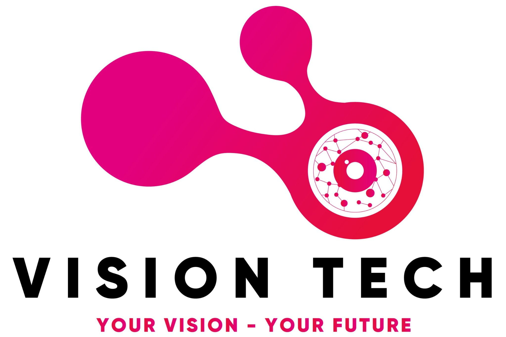
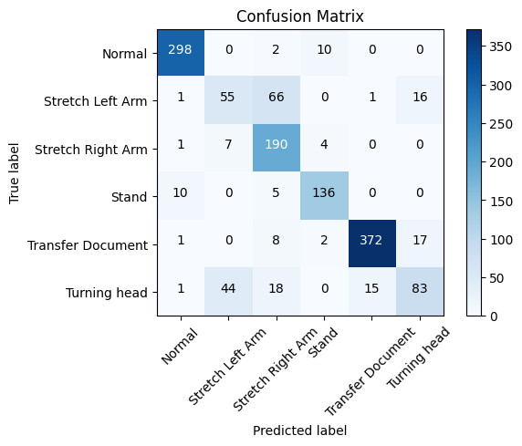
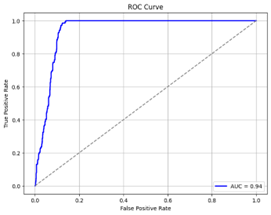
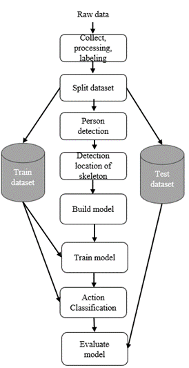

[English](README.md) | [简体中文](cn_readme.md) | [Tiếng việt](README.vietnam-vn.md)

## Contents
1. [OpenPose with Recurrent Neural Network](#introduction)
2. [Results](#results)
3. [Installation](#installation)
4. [Quick Start Overview](#quick-start-overview)
5. [Structures](#structures)
6. [Send Us Feedback!](#send-us-feedback)
7. [Thanks](#thanks)
8. [License](#license)


# Introduction

Bài báo này cung cấp một cách thực hiện phát hiện bất thường với sự kết hợp giữa OpenPose và RNN. Để đơn giản, chúng tôi gọi mô hình này là OpenPoseRNN trong phần còn lại của readme này. Và chúng tôi cũng cảm ơn Tiến sĩ Phạm Minh Chuẩn và Tiến sĩ Hoàng Quốc Việt đã hỗ trợ cho dự án này. Hệ thống dựa trên học sâu này đang được áp dụng ở các quốc gia phát triển trên toàn thế giới như Anh, Pháp, Hoa Kỳ và các quốc gia châu Á khác như Nhật Bản, Hàn Quốc, Trung Quốc, v.v. Một số trường đại học như Đại học Thanh Hoa, Đại học Bắc Kinh, Đại học Stanford,… đã sử dụng công nghệ để chống gian lận trong kỳ thi. Nó đang được triển khai phối hợp với các giám thị kỳ thi để đạt hiệu quả cao nhất và đảm bảo công bằng tối đa trong các kỳ thi.

# Results
### Tổng quan phát hiện gian lận ( sử dụng OpenPose và Yolov3+ mạng thần kinh hồi quy)
<p align="center">
    
    <br>
    <sup>Kiểm tra với lớp 12422TN class <a href="https://github.com/CMU-Perceptual-Computing-Lab/openpose" target="_blank"><i> dùng OpenPose </i></a>
</p>

### Phát hiện người
Trong phần này, nhóm chúng tôi sử dụng [YOLOv3](https://github.com/ultralytics/yolov3) để phát hiện người trong phòng thi. Để đánh giá mô hình này, chúng tôi sử dụng một phần dữ liệu được tách ra từ bộ dữ liệu [MS-COCO 2017](https://cocodataset.org/#home) . Kết quả thể hiện trong bảng 1. 

**Table 1. So sánh mô hình với 2 mô hình khác**
|    Models   | Avg. | Precision |  IoU |
|:-----------:|:----:|:---------:|:----:|
| [Faster-RCNN](https://arxiv.org/abs/1506.01497) | 21.9 |    42.7   |   -  |
|    SSD300   | 25.2 |    43.1   | 26.1 |
|    YOLOv2   | 21.6 |     44    | 19.2 |
|   **Ours**    |**25.3**| **44.5**   | **25.9** |

### Phát hiện vị trí khung xương

Để phát hiện vị trí của các khung xương, nhóm chúng tôi sử dụng [OpenPose]("https://github.com/CMU-Perceptual-Computing-Lab/openpose) để phát hiện khung xương người và trích xuất chúng. Để đánh giá chi phần phát hiện khung xương, nhóm chúng tôi sử dụng bộ dữ liệu [MS-COCO2015](https://cocodataset.org/#home). Kết quả thể hiện trong bảng 1.

**Bảng 2. Đánh giá mô hình phát hiện khung xương với 2 mô hình khác**
|     Models    |  AP@0.5  |  AP@0.75 | AP medium | Ap large |
|:-------------:|:--------:|:--------:|:---------:|----------|
| [AlphaPose]() |   89.2   |   79.1   |     69    | 78.6     |
|     Detectron Mask-RCNN    |   25.2   |   43.1   |    26.1   | 68.2     |
|    **Ours**   | **88.0** | **73.1** |  **62.2** | **78.6** |

Ngoài ra, nhóm chúng tôi cũng sử dụng . Kết quả thể hiện tại bảng 3 cho nhiều người và bảng 4 cho 1 người.

**Bảng 3. Results in Multi-people**
|     Models    |  GPU Memory Usage  |  FPS(Frame Per second  |
|:-------------:|:--------:|:--------:|
| AlphaPose |   73.4%   |   1.15   |
|    **Ours**   | **21.3%** | **18.39** |

**Bảng 4. Results in Single-people**
|     Models    |  GPU Memory Usage  |  FPS(Frame Per second  |
|:-------------:|:--------:|:--------:|
| AlphaPose |   60.3%   |   23.71   |
|    **Ours**   | **21.3%** | **18.77** |

### Phân loại hành động
Nhóm chúng tôi dùng [Recurrrent Neural Network](https://en.wikipedia.org/wiki/Recurrent_neural_network) (RNN) để phân loại các hành động của thí sinh trong phòng thi. Để đánh giá phần này, nhóm chúng tôi sử dụng 2 độ đo là Confusion Matrix và Receiver operating characteristic (ROC). Kết quả thể hiện tại [Hình 1](github/image/confMatrix.jpg) và [Hình 2](github/image/RocCurves)

<p align="center">
    
    <br>
    <sup>Bảng 1. Kết quả của tất cả các lớp với độ đo<a href="https://en.wikipedia.org/wiki/Confusion_matrix" target="_blank"><i> Confusion Matrix  </i></a>
</p>

<p align="center">
    
    <br>
    <sup>Hình 2. Kết quả của tất cả các lớp với độ đo<a href="https://developers.google.com/machine-learning/crash-course/classification/roc-and-auc" target="_blank"><i> ROC  </i></a>
</p>

        
# Installation

### Với môi trường Python
Yêu cầu phiên bản python >= 3.7
1. Cài đặt các thư viện phụ thuộc cho chương trình
 ```bash
 pip install -r requirements.txt
```
2. Cài đặt các tệp phụ thuộc cho chương trình
- Chuyển vị trí thư mục tới ``` OpenPose/graph_models/VGG_origin```, bạn có thể dùng câu lệnh dưới đây để chuyển vị trí thư mục ```cd OpenPose/graph_models/VGG_origin ```
- Sau đó chạy tệp python ``` file_requirements.py ``` hoặc
 ``` bash
python file_requirements.py
```
3. Tải xuống một số phần phụ thuộc cho chương trình ( Tuỳ chọn )
- Nếu bước 2 xảy ra lỗi, bạn có thể tải trực tiếp từ [Google Drive](https://drive.google.com/drive/folders/1Y4coXLsVzCXYuCKpyDfQBqpHH8Aj-Yg5?usp=sharing)
- Di chuyển thư mục ```graph_models``` đã tải xuống tới ```OpenPose\graph_models``` 

### Với Anaconda 
1. Cài đặt thư viện phụ thuộc
   - Bạn có thể cài đặt các thư viện đi kèm với chương trình với tệp ``` openpose.yaml``` file.
   - Bạn có thể tìm thấy tệp ```openpose.yaml```  nằm trong thư mục  ```Environment```
2. Cài đặt các tệp phụ thuộc cho chương trình
- Chuyển vị trí thư mục tới ``` OpenPose/graph_models/VGG_origin```, bạn có thể dùng câu lệnh dưới đây để chuyển vị trí thư mục ```cd OpenPose/graph_models/VGG_origin ```
- Sau đó chạy tệp python ``` file_requirements.py ``` hoặc
 ``` bash
python file_requirements.py
```
3. Tải xuống một số phần phụ thuộc cho chương trình ( Tuỳ chọn )
- Nếu bước 2 xảy ra lỗi, bạn có thể tải trực tiếp từ [Google Drive](https://drive.google.com/drive/folders/1Y4coXLsVzCXYuCKpyDfQBqpHH8Aj-Yg5?usp=sharing)
- Di chuyển thư mục ```graph_models``` đã tải xuống tới ```OpenPose\graph_models``` 


# Quick Start Overview
### Với Anaconda và mô trường python 
1. Chạy nhanh
 - Để chạy chương trình, bạn có thể chạy tệp ```main.py```.
2. [Tuỳ chọn] Để huấn luyện mô hình theo ý của bạn, bạn hãy sử dụng tệp ```create_data.py``` để xuất các điểm dữ liệu của khung xương sau đó chuyển tới thư mục ```Action\trainning``` và sử dụng tệp .ipnb ```train.ipnb``` để huấn luyện.
3. [Tuỳ chọn] Sử dụng VGG_origin có thể chạy rất chậm, nếu máy bạn không có GPU, bạn có thể chuyển mô hình sang  mô hình ```mobilenet``` để chạy nhanh hơn.
   - Để chuyển mô hình sang ```mobilenet```,  điều hướng tới tệp ```main.py``` tại thư mục chính.
   - Tại dòng 14, thay đổi ``` estimator = load_pretrain_model('VGG_origin')``` thành ```estimator = 
 load_pretrain_model('mobilenet_thin')```
   
4.[Tuỳ chọn] Để sử dụng weight của bạn, bạn có thể thay nó trong tệp ```main.py```, tại dòng 15 thay đổi ```action_classifier = load_action_premodel('open_pose2\Action\framewise_recognition_under_scene.h5')``` thành ```action_classifier = load_action_premodel('path_to_your_weights')```
  
# Structures
**Cấu trúc của mô hình này**
<p align="center">
    
    <br>
</p>

# Send Us FeedBack
Dự án của nhóm chúng tôi là mã nguồn mở, và chúng tôi muốn cải thiện chúng trong tương tương lại. Vì vậy, hãy cho chúng tôi biết (tạo vấn đề GitHub mới hoặc kéo yêu cầu, gửi email cho chúng tôi, v.v.) nếu bạn...
1. Tìm/sửa bất kỳ lỗi nào (về chức năng hoặc tốc độ) hoặc biết cách tăng tốc hoặc cải thiện bất kỳ phần nào của OpenPoseRNN.
2. Muốn thêm/hiển thị một số chức năng/bản demo/dự án thú vị được thực hiện dựa trên Theo dõi Học sinh. Chúng tôi có thể thêm liên kết dự án của bạn vào [Issue](https://github.com/datnguyen-tien204/OpennPose-with-RNN/issues)

# Thanks
Cảm ơn sự hướng dẫn của TS. Phạm Minh Chuẩn trong quá trình tạo nên dự án này, cũng như tiến sĩ Hoàng Quốc Việt, người đã giúp chúng tôi cải thiện kết quả và đưa ra những phản hồi cho dự án này.

# License
Dự án này được cung cấp miễn phí cho mục đích sử dụng phi thương mại. Nếu hữu ích bạn có thể cho 1 sao. Cảm ơn đã sử dụng
